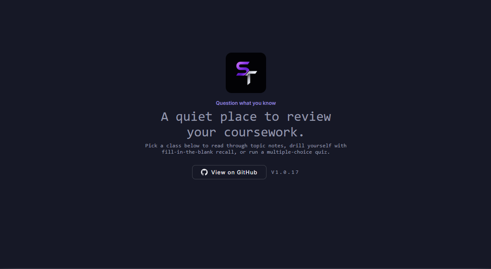
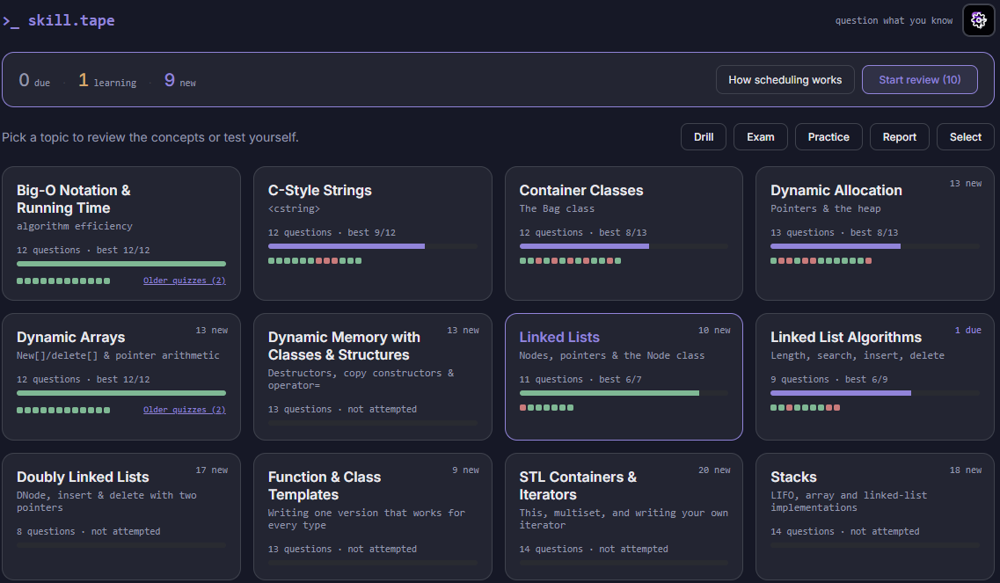
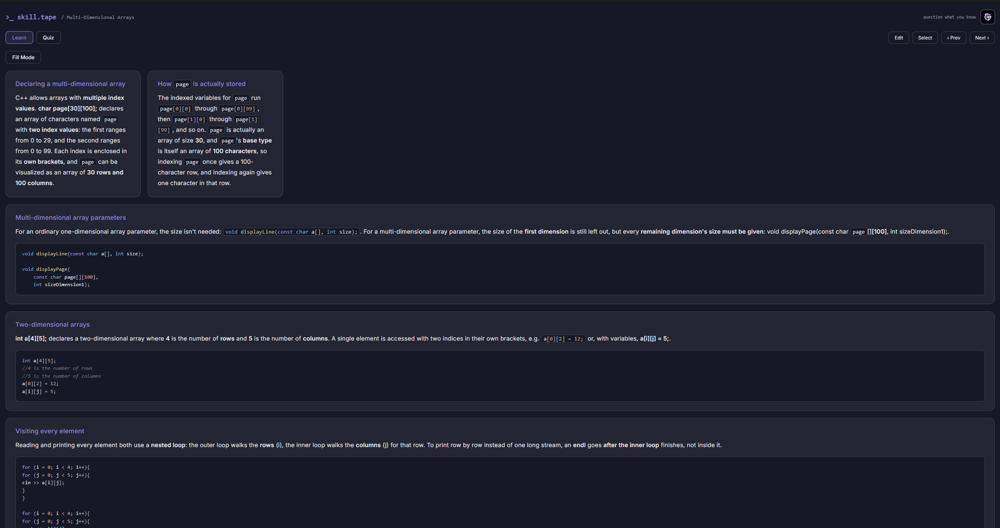
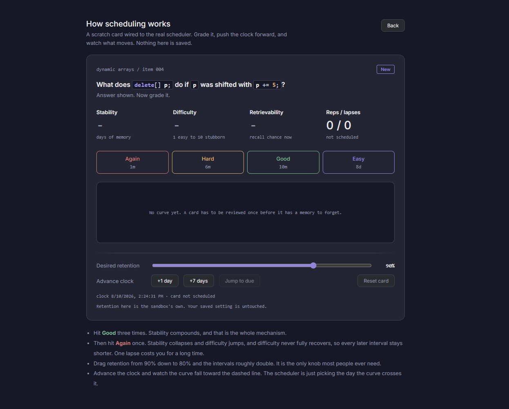
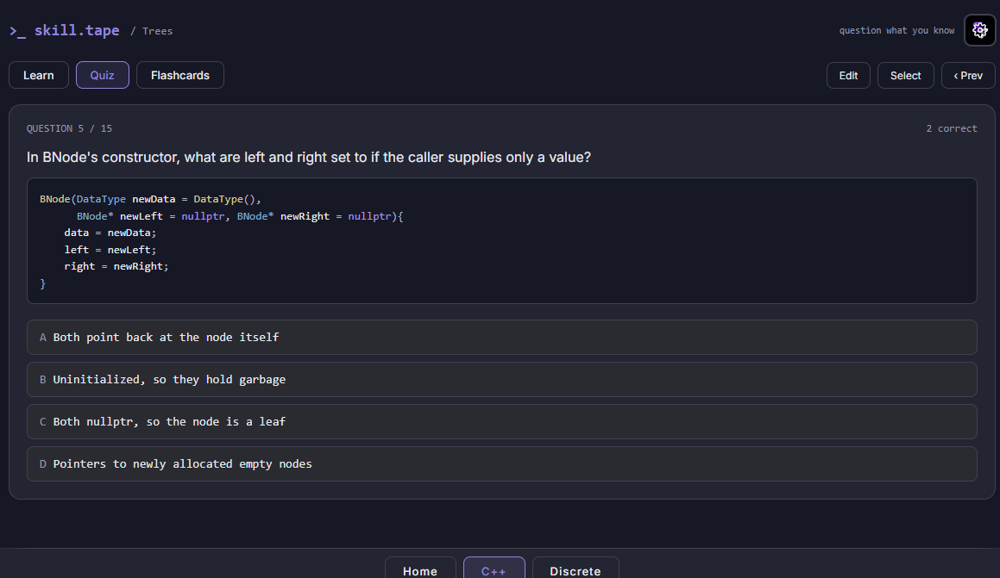
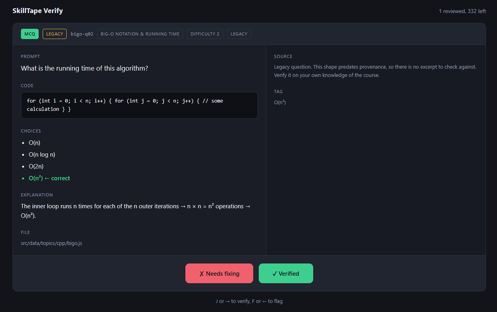

# SkillTape
SkillTape is still being worked on and is not yet ready for production use. Please see [`docs/ROADMAP.md`](docs/ROADMAP.md) for the current development status.

A self-hosted study platform for computer-science coursework.

SkillTape turns course material into interactive study tools: read structured notes, recall key concepts from memory, practice with quizzes and flashcards, and track your progress over time.

It is built as a React single-page application with an Express + SQLite backend and an optional Electron desktop client.

The goal is for users to be able to select from courses created but also create their own. Functioning as a hub where students can share their courses and problem sets.

## Design Principle

**Accuracy comes first.**

Course content is intended to be thoroughly checked before being placed into the active study rotation. Structural validation is automated; factual accuracy requires human verification.

## Screenshots

### Home

<p align="center">
  
</p>

Select a course to open its topics and study material.

### Course Topics

<p align="center">
  
</p>

Each course has a topic list and review queue showing:

- Due items
- Learning items
- New items
- One-click **Start Review**
- Question count
- Best score
- Recent attempt history

### Learn Mode

<p align="center">
  
</p>

**Learn Mode** presents course notes as cards. Key terms are emphasized and can be hidden with **Fill Mode**, allowing you to recall the missing information from memory.

### Scheduling Sandbox

<p align="center">
  
</p>

**Scheduling Sandbox** is a development tool for experimenting with the study scheduler.

Grade an item, advance the clock, and observe how its scheduling state changes. Nothing in the sandbox is saved.

### Quiz Mode

<p align="center">
  
</p>

**Quiz Mode** provides multiple-choice drills for individual topics.

Quizzes normally contain **7–14 questions**. The **Master Quiz** can combine multiple topics into one larger quiz.

### Question Verification

<p align="center">
  
</p>

**Question Verification** is the human accuracy check for the question bank.

`npm run verify` displays unverified questions one at a time, along with their answers and source excerpts. Questions can be verified or flagged for later correction.

See [Verifying Questions](#verifying-questions).

---

## Courses

SkillTape currently supports multiple courses through the bottom navigation bar.

| Tab | Course | Focus |
| --- | --- | --- |
| `C++` | C++ Data Structures & Algorithms | Big-O, C-strings, containers, linked lists, the Big Three |
| `Discrete` | Discrete Structures (Epp, 5e) | Logic, quantifiers, proof, sets, relations, graphs |

Selecting a course filters the application to that course's topics.

---

## Features

### Learning

- **Learn Mode** — Structured notes presented as cards.
- **Fill Mode** — Hides emphasized terms so you can recall them from memory.
- **Flashcards** — Front/back study cards for each topic.
- **Diagrams** — Optional captioned figures can be attached to cards and questions.
- **Big-O Visualizations** — C++ topics can display complexity-growth charts and reference tables.

### Assessment

- **Quiz Mode** — Multiple-choice questions with immediate feedback and explanations.
- **Master Quiz** — Combines questions from multiple topics within a course.
- **Drill Mode** — Closed-book, timed practice designed to simulate exam conditions.
- **Mixed-format Items** — The planned item system supports recall, writing, tracing, error finding, cloze, comparison, complexity, MCQ, and diagram questions.

### Progress

- Best score per topic
- Run count
- Recent attempt history
- Server-side progress storage
- Progress available across browsers after logging in
- Spaced-repetition scheduling

### Content Management

- **Edit Mode** — Edit Learn cards and flashcards directly from the application.
- **Question Verification** — Human verification for question accuracy.
- **Content Provenance** — Questions can reference their source, anchor, and source excerpt.
- **Question-bank Auditing** — Automated validation of item structure and required fields.

---

## Spaced Repetition

SkillTape currently uses a **Leitner 5-box scheduler**.

| Result | Effect |
| --- | --- |
| Correct | Advances the item to the next box |
| Incorrect | Returns the item to Box 1 and increments `lapses` |
| 3+ lapses | Item becomes a **leech** and is removed from normal rotation |

The default intervals are:

**1 → 2 → 4 → 8 → 16 days**

A leech is treated as a signal that the question or explanation may need to be rewritten.

Leitner was chosen over SM-2 because the simpler system is easier to understand, debug, and tune.

See [`docs/CS_DRILL_BUILD_SPEC.md`](docs/CS_DRILL_BUILD_SPEC.md) for the scheduling specification.

> **Implementation note:** Scheduling state (`box`, `dueOn`, `lapses`, `leech`) is not yet part of `src/data/itemSchema.js`.

---

# Getting Started

## Requirements

- Node.js 18+
- npm
- SQLite
- Docker, if using the containerized deployment
- Electron dependencies, if building the desktop application

## Install

```bash
npm install
```

## Run the Development Environment

Start the frontend:

```bash
npm run dev
```

Start the API in a separate terminal:

```bash
npm run dev:server
```

The frontend runs at:

```text
http://localhost:5173
```

The API runs at:

```text
http://127.0.0.1:3001
```

Seed the database:

```bash
npm run db:seed
```

The normal development setup therefore requires **both `dev` and `dev:server`** running simultaneously.

See [`docs/BACKEND.md`](docs/BACKEND.md) for details about the API, database, and two-process architecture.

## Useful Commands

| Command | Purpose |
| --- | --- |
| `npm run dev` | Start the Vite development server |
| `npm run dev:server` | Start the Express API |
| `npm run db:seed` | Seed or refresh curriculum content |
| `npm run build` | Create a production build |
| `npm run preview` | Preview the production build |
| `npm run audit:bank` | Validate the question bank |
| `npm run verify` | Review unverified questions |

### Question-bank audit

`npm run audit:bank` currently reports failures because legacy MCQs have not yet been migrated to the planned item schema.

The legacy questions are missing fields such as:

- `id`
- `format`
- `provenance`

This is currently expected. Until migration is complete, treat the audit output as a **migration checklist rather than a regression report**.

---

# Verifying Questions

`verifiedByHuman` is SkillTape's accuracy gate.

Automated auditing validates structure, but it does **not** determine whether a question is factually correct. Human verification is required for that.

The verification tool provides a small local review interface separate from the main application.

## 1. Start Verification

```bash
npm run verify
```

The browser opens automatically.

The main application does not need to be running.

### Useful filters

Verify one topic:

```bash
npm run verify -- --topic bigo
```

Verify only item-based questions:

```bash
npm run verify -- --only items
```

Verify only legacy Discrete questions:

```bash
npm run verify -- --only legacy --topic discrete
```

`--topic` accepts either a topic ID or course ID such as `cpp` or `discrete`.

The default port is `4200`.

## 2. Review Questions

Use:

- `J` or `→` — Verify
- `F` or `←` — Flag as broken

Flagged questions require a reason.

Each decision immediately updates the corresponding seed-file entry, so stopping the verification process with `Ctrl-C` is safe.

## 3. Review the Changes

```bash
git diff --stat
cat data/needs-fixing.json
```

Each verified question produces a small, focused change.

`data/needs-fixing.json` contains flagged questions and is gitignored.

## 4. Reseed the Database

After verifying item-based questions:

```bash
npm run db:seed
```

Practice, Drill, and Exam modes read from the `items` database table and require `verified_by_human`.

Legacy `questions[]` entries do not currently have this database field and are served by Quiz regardless of verification status.

## Check Remaining Unverified Questions

Without starting the verification UI:

```bash
grep -rc "verifiedByHuman: false" src/data/topics/ | grep -v ':0'
```

Legacy questions were created before the verification flag existed. The migration script added an explicit `verifiedByHuman: false` to the existing legacy questions so their state is visible.

```bash
node scripts/backfillVerifiedFlag.mjs
```

The script is idempotent and supports:

```bash
node scripts/backfillVerifiedFlag.mjs --dry-run
```

---

# Docker

Start the application:

```bash
docker compose up -d --build
```

Check the containers:

```bash
docker compose ps
```

View API logs:

```bash
docker compose logs -f api
```

Stop the application:

```bash
docker compose down
```

## Code Changes vs. Content Changes

These two types of changes are handled differently.

### Code Changes

Changes to:

- React components
- Routes
- `index.html`
- `src/`
- `server/`
- Other application code

require an image rebuild:

```bash
docker compose up -d --build
```

There is no live reload or source bind mount in the Docker setup, so:

```bash
docker compose up -d
```

will continue serving the previously built code.

### Content Changes

Changes to topic content under:

```text
src/data/topics/**
```

are loaded into SQLite through the seed process.

Run:

```bash
npm run db:seed
```

You do **not** need to rebuild the Docker image.

The database file:

```text
./db/skilltape.db
```

is bind-mounted into the API container, so reseeding on the host updates the database used by the running container.

---

# Desktop App

SkillTape can also be packaged as an Electron desktop application.

The desktop client:

- Runs in its own window
- Does not require a terminal
- Can work offline
- Uses the same React frontend
- Uses the same Express + SQLite backend
- Starts the existing backend as child processes

## Development

```bash
npm run electron:dev
```

## Linux Build

```bash
npm run electron:build
```

This produces Linux `.AppImage` and `.deb` packages.

## Windows Build

```bash
npm run electron:build:win
```

This cross-builds a Windows NSIS installer from Linux.

## Full Electron Build

```bash
npm run all:electron
```

## Release

```bash
npm run release:win
```

See [Releasing an Update](#releasing-an-update).

---

# Electron Packaging Notes

## Native Modules

SkillTape uses native Node modules including:

- `better-sqlite3`
- `bcrypt`

These modules must use binaries compiled for the target operating system.

### Linux

The Linux build runs `electron-rebuild` for the current host.

### Windows

The Windows build intentionally **does not** run `electron-rebuild`.

Instead, the build removes stale native build artifacts so Electron uses the Windows prebuilt binaries included with the npm packages.

Running `electron-rebuild` manually before the Windows build can produce Linux native binaries inside the Windows package and cause runtime errors such as:

```text
bcrypt_lib.node is not a valid Win32 application
```

Do not add a local native rebuild step to the Windows packaging path without accounting for cross-platform native modules.

## Verifying the Windows Package

Check the bcrypt binary:

```bash
file dist-electron/win-unpacked/resources/app.asar.unpacked/node_modules/bcrypt/prebuilds/win32-x64/bcrypt.node
```

It should report a Windows `PE32+` binary.

Check for stale native build artifacts:

```bash
find dist-electron/win-unpacked -path '*bcrypt*build*'
```

The command should return nothing.

## Wine Requirements

Cross-building Windows packages from Linux requires Wine:

```bash
sudo apt-get install -y wine64
sudo dpkg --add-architecture i386
sudo apt-get update
sudo apt-get install -y wine32:i386
```

If Wine was previously initialized before 32-bit support was installed, remove the existing Wine prefix before retrying:

```bash
rm -rf ~/.wine
```

---

# Electron Version Requirement

Electron is pinned to version 35 or newer because SkillTape's native SQLite dependency requires Node 22's N-API surface.

Electron versions 34 and earlier bundle Node 20.

Check the N-API version bundled with Electron:

```bash
ELECTRON_RUN_AS_NODE=1 node_modules/electron/dist/electron \
  -e "console.log(process.versions.napi)"
```

The result should be:

```text
10
```

A result of `9` indicates Node 20 and is not compatible with the current native SQLite setup.

If upgrading Electron, verify the bundled Node/N-API version before investigating native crashes elsewhere.

---

# Packaged Application

The packaged application stores its SQLite database in Electron's per-user application-data directory rather than the repository's `./db/` directory.

For example, Linux uses:

```text
~/.config/SkillTape
```

The packaged application automatically runs the database seed process on startup. The seed operation is idempotent, so a terminal-based `npm run db:seed` is not required for installed applications.

## Current Packaging Limitations

- No custom application icon has been configured yet.
- macOS packaging is not currently configured.
- Windows installers are unsigned.
- Windows SmartScreen may warn about the unsigned installer.
- Code signing has not yet been implemented.

The SmartScreen warning is expected for the current unsigned release configuration.

---

# Releasing an Update

Installed versions check GitHub Releases when the application starts and every six hours.

To publish an update:

### 1. Update the Version

Update the `version` field in `package.json`.

### 2. Set the GitHub Token

```bash
export GH_TOKEN=...
```

The token needs permission to write releases.

### 3. Commit and Push

```bash
git add .
git commit -m "Your commit message"
git push
```

### 4. Publish

```bash
npm run release:win
```

The release script validates the version and token before publishing.

## Optional Release Helper

A shell function can automate the process:

```bash
release() {
  git add . &&
  git commit -m "$1" &&
  npm version patch &&
  git push --follow-tags &&
  npm run release:win
}
```

Then:

```bash
release "commit message"
```

> **Security:** Do not store a GitHub token directly in a shared or publicly accessible shell configuration file.

## Why SkillTape Uses a Custom Release Script

GitHub draft releases create a subtle problem for `electron-updater`.

The updater discovers releases through GitHub's release feed, which does not expose draft releases. Electron Builder can also reuse an existing draft rather than converting it into a published release.

SkillTape's release script therefore:

1. Creates or uses a draft release.
2. Uploads the required assets.
3. Verifies that `latest.yml` exists.
4. Verifies that the `.exe` exists.
5. Verifies that the `.blockmap` exists.
6. Confirms the asset names match `latest.yml`.
7. Publishes the release only after validation succeeds.

This prevents the updater from seeing a partially uploaded release.

The Windows installer intentionally uses a space-free filename:

```text
SkillTape-Setup-${version}.exe
```

This avoids filename inconsistencies between GitHub, Electron Builder, and `electron-updater`.

---

# Auto Updates

The installed application displays update progress through `UpdateBanner.jsx`.

The UI shows states such as:

```text
Downloading update X... n%
```

and:

```text
Update X ready — Restart now
```

The installed version is displayed next to the **View on GitHub** link.

## Update Logs

Windows:

```text
%APPDATA%\SkillTape\logs\main.log
```

Linux:

```text
~/.config/SkillTape/logs/main.log
```

These logs are particularly important for diagnosing problems in the packaged application because it does not have a development console.

## Update Security

`electron-updater` verifies downloaded assets using the SHA-512 hash contained in `latest.yml`.

Downloads are served over HTTPS.

The remaining security limitation is **code signing**. Updates are integrity-checked, but the Windows installer does not currently provide publisher identity through a code-signing certificate.

---

# Project Structure

```text
├── index.html
├── main.jsx
├── vite.config.js
│
├── scripts/
│   ├── auditBank.js
│   ├── backfillVerifiedFlag.mjs
│   └── release.mjs
│
├── tools/
│   └── verify/
│       ├── server.js
│       ├── flag.js
│       └── public/
│
├── electron/
│   ├── main.cjs
│   └── preload.cjs
│
├── src/
│   ├── Shell.jsx
│   ├── App.jsx
│   │
│   ├── data/
│   │   ├── courses.js
│   │   ├── curriculum.js
│   │   ├── complexity.js
│   │   ├── itemSchema.js
│   │   ├── theme.js
│   │   └── topics/
│   │       └── <course>/<topic>.js
│   │
│   ├── components/
│   │   ├── Home.jsx
│   │   ├── TopicView.jsx
│   │   ├── LearnView.jsx
│   │   ├── QuizView.jsx
│   │   ├── MasterQuizView.jsx
│   │   ├── FlashcardsView.jsx
│   │   ├── HistoryModal.jsx
│   │   ├── Header.jsx
│   │   ├── Inline.jsx
│   │   ├── FillBody.jsx
│   │   ├── Figure.jsx
│   │   ├── ComplexityChart.jsx
│   │   ├── ReferenceTable.jsx
│   │   └── UpdateBanner.jsx
│   │
│   ├── hooks/
│   │   ├── useProgress.js
│   │   └── useUpdater.js
│   │
│   └── utils/
│       └── fill.js
│
└── public/
    └── figures/
```

---

# Adding Course Content

Course content lives under:

```text
src/data/topics/<course>/<topic>.js
```

Topics are imported by:

```text
src/data/curriculum.js
```

For the complete authoring rules, see [`docs/AUTHORING.md`](docs/AUTHORING.md).

## Add a Course

1. Add the course to `src/data/courses.js`.
2. Give its topics the matching course ID.
3. Add the course tab to `src/Shell.jsx`.

## Add a Topic

1. Create the topic file.
2. Import it in `curriculum.js`.
3. Include the `.js` extension in the import.
4. Add it to the exported curriculum array.
5. Add the topic's cards and questions.

Each topic contains:

- `cards` — Learn Mode material
- `questions` — Quiz material

## Key Terms

Wrap important terms in double asterisks:

```text
**binary search tree**
```

These are rendered as bold text in Learn Mode and become blanks in Fill Mode.

## Accepted Answers

Fill Mode automatically normalizes:

- Case
- Spacing
- Hyphens
- Exponent notation
- Plurals
- Number words

When a synonym cannot be derived automatically, specify additional accepted answers:

```js
accept: {
  "O(n)": ["linear", "linear time"]
}
```

## Figures

Attach a figure to a card or question using:

```js
{
  src,
  alt,
  caption
}
```

Place the image under:

```text
public/figures/
```

---

# Item Formats

The item schema is defined in:

```text
src/data/itemSchema.js
```

It is validated by:

```bash
npm run audit:bank
```

The C++ topics have been migrated to the item system. The Discrete topics have not yet been fully migrated.

Every migrated item should include provenance identifying:

- Source
- Stable anchor
- Verbatim source excerpt

Source anchors should not be renumbered or deleted once items reference them.

## Target Distribution

| Format | Target | Purpose |
| --- | ---: | --- |
| `recall` | 20% | Recall a definition or rule |
| `write` | 20% | Produce code or a proof from a specification |
| `trace` | 15% | Determine code output or final state |
| `error` | 5% | Locate a bug and identify the violated rule |
| `cloze` | 5% | Fill in a critical token |
| `compare` | 5% | Distinguish between related concepts |
| `complexity` | 5% | Determine Big-O and justify it |
| `mcq` | 25% | Select the correct answer from four options |

MCQs remain a meaningful part of the bank because they provide instant client-side grading and make existing course questions useful for spaced repetition.

Where practical, MCQs should be paired with an open-ended version of the same concept. Recognition is easier than production, so the open-ended version provides the more demanding assessment.

---

# Documentation

Additional documentation is located in `docs/`.

| Document | Purpose |
| --- | --- |
| [`AUTHORING.md`](docs/AUTHORING.md) | How to create and edit course content |
| [`BACKEND.md`](docs/BACKEND.md) | API, database, and authentication architecture |
| [`CORRECTIONS.md`](docs/CORRECTIONS.md) | Code review findings and corrections |
| [`CS_DRILL_BUILD_SPEC.md`](docs/CS_DRILL_BUILD_SPEC.md) | Drill-system specification |
| [`SKILLTAPE_INTEGRATION.md`](docs/SKILLTAPE_INTEGRATION.md) | Tutor-skill integration |
| [`PLAN_PLATFORMIZE.md`](docs/PLAN_PLATFORMIZE.md) | Multi-course and platform roadmap |
| [`ROADMAP.md`](docs/ROADMAP.md) | What is still open |

Some documentation describes planned or partially implemented functionality. For current behavior, prioritize this README and the implementation itself.

---

# Important Notes

## Course Materials

Lecture slides, textbook PDFs, and zyBooks exports are intentionally excluded from the repository because they are copyrighted course materials.

Before pushing, check for accidentally tracked course materials:

```bash
git ls-files | grep -Ei '\.pdf$|^pages/'
```

## Accounts and Progress

SkillTape now includes a self-hosted Express + SQLite API and account system.

Accounts are:

- Optional for reading content
- Optional for taking quizzes
- Required for Edit Mode

Progress is stored server-side and associated with the user's account.

See [`docs/BACKEND.md`](docs/BACKEND.md) for the backend architecture.

## Accuracy vs. Validation

These systems perform different jobs:

| System | Purpose |
| --- | --- |
| `npm run audit:bank` | Validates structure and required fields |
| `npm run verify` | Human verification of factual accuracy |
| `npm run db:seed` | Loads content into the database |

**The audit does not prove that a question is correct.**

Only human verification establishes the current accuracy status of a question.

---

# Current Development Status

SkillTape is actively transitioning from its original C++-specific architecture into a multi-course study platform.

The major pieces already in place include:

- Multi-course navigation
- React frontend
- Express + SQLite backend
- Account-based progress
- Learn Mode
- Fill Mode
- Quiz Mode
- Master Quiz
- Flashcards
- Question verification
- Docker deployment
- Electron desktop packaging
- Windows release/update pipeline
- Spaced-repetition infrastructure
- Structured item schema

Some of the more advanced item formats, scheduling state, per-item attempt logging, and full curriculum migration remain under development.

For planned work, see [`docs/ROADMAP.md`](docs/ROADMAP.md) and [`docs/PLAN_PLATFORMIZE.md`](docs/PLAN_PLATFORMIZE.md).